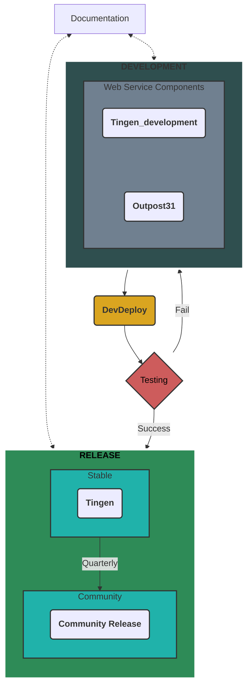

<!-- u240711 -->

  

  

# About Tingen

[Netsmart's Avatar™](https://www.ntst.com/Solutions-and-Services/Offerings/myAvatar) is a behavioral health EHR that offers a recovery-focused suite of solutions that leverage real-time analytics and clinical decision support to drive value-based care.

While Avatar™ is a robust platform, it isn't perfect. The good news is that you can extend myAvatar™ functionality via Netsmart's Avatar™ Web Services, and/or custom web services that are written by other Avatar™ users.

**Tingen** is one such custom web service which includes various tools and utilities for Avatar™ that aren't included in the official release, and provides a solid foundation for building additional functionality quickly and efficiently.

## Tingen features

* Several built-in tools and utilities for use with Avatar™
* A solid foundation to build additional Avatar™ custom tools and utilities
* Extremely customizable
* Robust logging

# About this repository

The Tingen repository isn't your standard GitHub repository with installation instructions, use case scenarios, etc.

Why? Because Tingen is comprised of the following projects, each with their own repositories:

* [**Tingen_development**](https://github.com/spectrum-health-systems/Tingen_development)  
  The development version of Tingen

* [**Outpost31**](https://github.com/spectrum-health-systems/Outpost31)  
  The core components/backend of Tingen

* [**DevDeploy**](https://github.com/spectrum-health-systems/Tingen-DevDeploy)  
  Tingen deployment utilities.

* [**Tingen Documentation**](https://github.com/spectrum-health-systems/Tingen-Documentation)  
  Detailed documentation covering everything you need to know about Tingen, and how to use it.

## Tingen development/release process

This repository is used for the latest **stable** Tingen release

Most likely this repository isn't going to be much use to you because it's ***not intended to be used in production environments***.

This repository is public because I want everything Tingen-related to be transparent and reviewable.

Also, unlike the [development versions](https://github.com/spectrum-health-systems/Tingen-Development) of Tingen, the stable release should be pretty clean and pretty.

If you're looking for something to use in your production environment, please see the the Community Release of Tingen (coming soon). <!--[the Community Release](https://github.com/spectrum-health-systems/Tingen-CommunityRelease).-->

And as always, please read the [Tingen documentation](https://github.com/spectrum-health-systems/Tingen-Documentation).

# Repository branches

There are three types of branches in this repository:

* [main](https://github.com/spectrum-health-systems/Tingen/tree/main)  
  The current stable release of Tingen.

* Tingen stable release archive snapshots.

# Documentation

You can find the Tingen API documentation [here](https://spectrum-health-systems.github.io/Tingen/).
